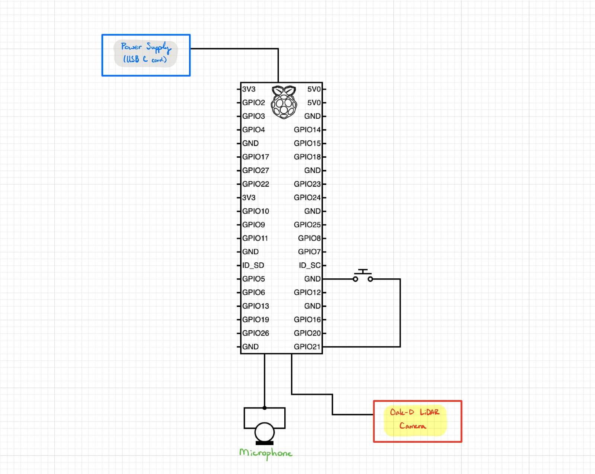

# Mimir: Hardware Components
For our hardware of Mimir, we have multiple components that is connected our computing source, Raspberry Pi 4.  The components are <br>
```
    - Raspberry Pi 4
    - Oak-D Lite Fixed Focus LiDAR Camera 
    - Raspberry Pi Camera
    - M/F Jumper Wires
    - Tactile Button
    - USB Microphone (USB Type-A)
```
Combining all these components creates our assistive device, Mimir. Most of our choices in designing our hardware of the device was mostly centered around out iniative towards having high computing power to process and perform multithreading of features and functions, such as our image processing, cloud client-server interactions, and hardware inputs/outputs. Which is why we mostly focused on using the Raspberry Pi 5, but eventually switched to the Raspberry Pi 4 instead, due to the better capacity in maintining and managing all our various inputs/outputs and multiple processes.


### Assembling the Device
When assmbing the device, we would first have our Raspberry Pi 4 (RPi 4), begin by setting it firmly in its customized 3D-printed case. Once set into the case, the LiDAR camera is placed into its housing unit, and the RPi Camera is attached to its docking camera feed. Next we attach the USB C to USB A cord from the LiDAR camera to the RPi 4, and attach screws to the RPi Camera to mount the camera to the lid of the case. The USB microphone can be attached to the USB input. Once fastened, the lid of the case can be closed and USB C cord can be plugged into a local wall outlet. The user can then press the button to initiate the device. <br>

<!-- Raspberry Pi 4 -->
<p align="center">

</p>
<p align="center">
Raspberry Pi 4 (w/USB Microphone, RPi Camera attached)
</p>

<br>

<p align="center">

</p>

<!-- device itself -->
<p align="center">

</p>

<p align="center">

</p>

<p align="center">

</p>

<p align="center">
Mimir Device<br>
</p>

### Schematics
The schematic for Mimir is rather quite simple to follow as most of the hardware components are minimal. Both external components of Mimir device are the USB Microphone (Type-A) and LiDAR camera. Both of which are connected via USB terminals on the RPi 4. On top of the RPi 4 is the power supply, which is powered by the USB C cord to a local wall outlet. Internally within the casing of the Mimir device, there is only one single tactile button. Which is connected to the GPIO 21 pin via soldered M/F jumper wires to the RPi 4 board itself. <br>

<p align="center">

</p>

### Power Requirements
Our power requirments only involves the usage of an USB C cord that can be plugged into the wall. This choice of power source was due to having multiple RPi's being fried from multiple attempts of attaching our RPi's battery pack and having the RPi perform multiple multithreading processes. Which was why we've decided to simply have our device powered via a USB C cord to supply power. In these photos, the white cord is the USB C cord and the black cord is the connection between the LiDAR camera and USB terminals of the RPi 4. As well as the USB Microphone (type-A) connected to the USB terminals of the RPi 4. <br>

<p align="center">

</p>

<p align="center">

</p>

### Vendor and Bill of Materials (BOM)
Throughout our entirety of the project, most of our vendor of supplies were mostly met by submitting orders through Amazon. However, during our development we've had multiple trials and errors of damaging our RPi due to multiprocesses that we tried to load the RPi with. Eventually, we learned from the past iterations and were able to manage these multiprocesses properly and have our system firmly run on an RPi 4. This list encompasses and shows all of the team's expenditures during throughout the entire development of the final product. Some components on the list were left out due to easier configurations (i.e. CPZZ Rechargable Battery pack).

<p align="center">

</p>
<p align="center">
Bills of Materials<br>
</p>

<br>

More information can be found in our [User's Manual](./Users-Manual.pdf).<br>
<br>

### References
[User's Manual](./Users-Manual.pdf) <br>
