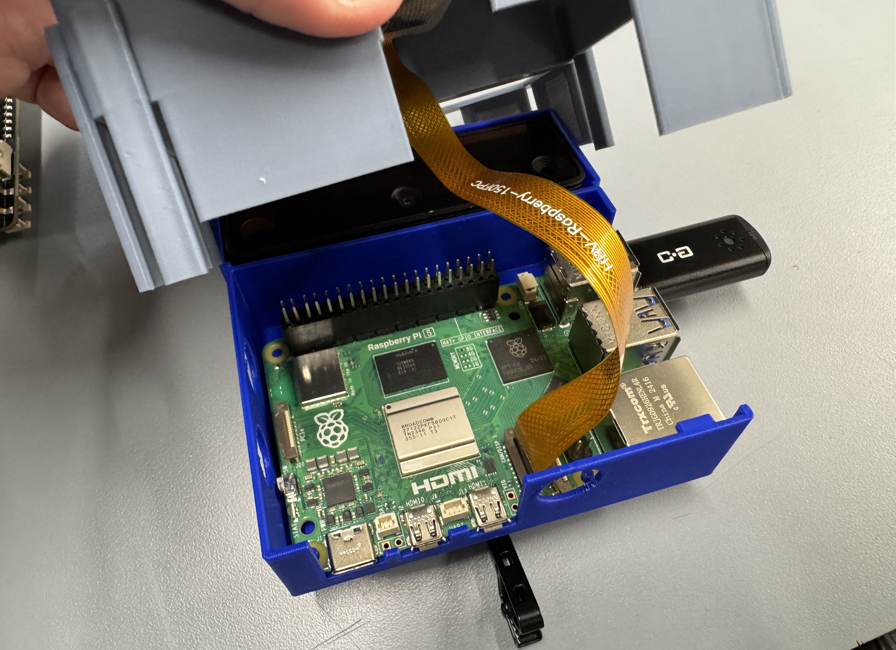
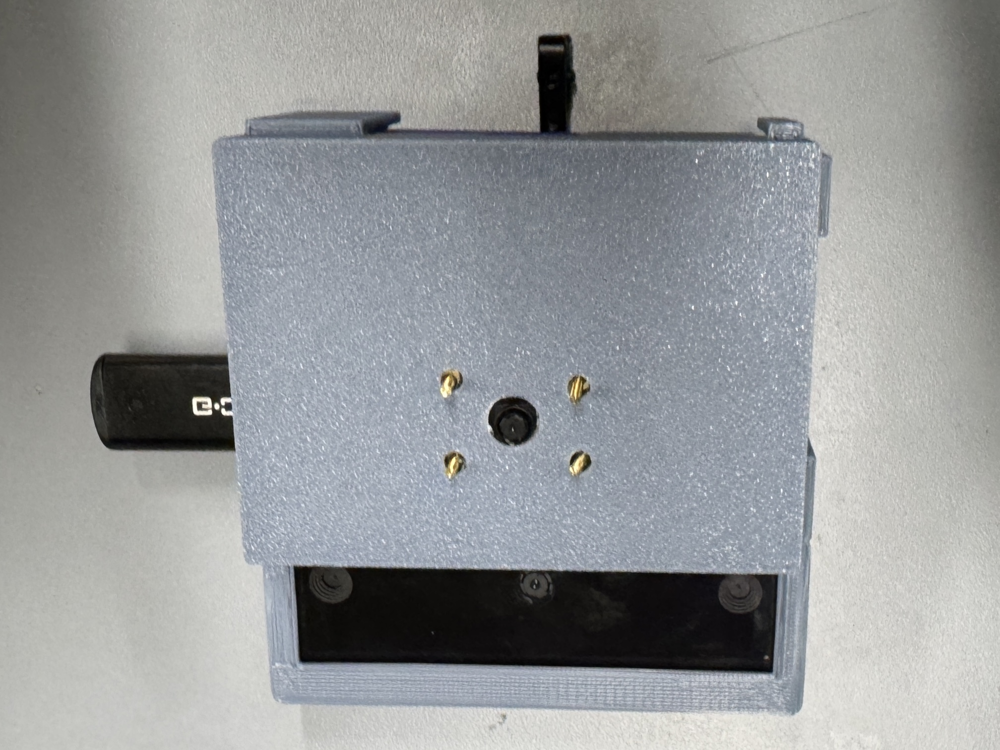

# Mimir: Hardware Components
For our hardware of Mimir, we have multiple components that is connected our computing source, Raspberry Pi 4.  The components are: <br>
```
    - Raspberry Pi 4
    - LiDAR Camera 
    - Raspberry Pi Camera
    - M/F Jumper Wires 
    - Battery Pack for RPi 4
    - Tactile Buttons
    - USB Microphone
```
Combining all these components create our assistive device, Mimir.


### Assembling the Device
When assmbing the device, we have  <br>

<p align="center">

</p>

<p align="center">
Raspberry Pi 4<br>
</p>

<!-- device itself -->
<p align="center">

</p>

<p align="center">
Device Itself<br>
</p>

### Schematics
text <br>


### Power Requirements
text <br>


### Vendor and Bill of Materials (BOM)
text <br>


### References
[]() <br>
