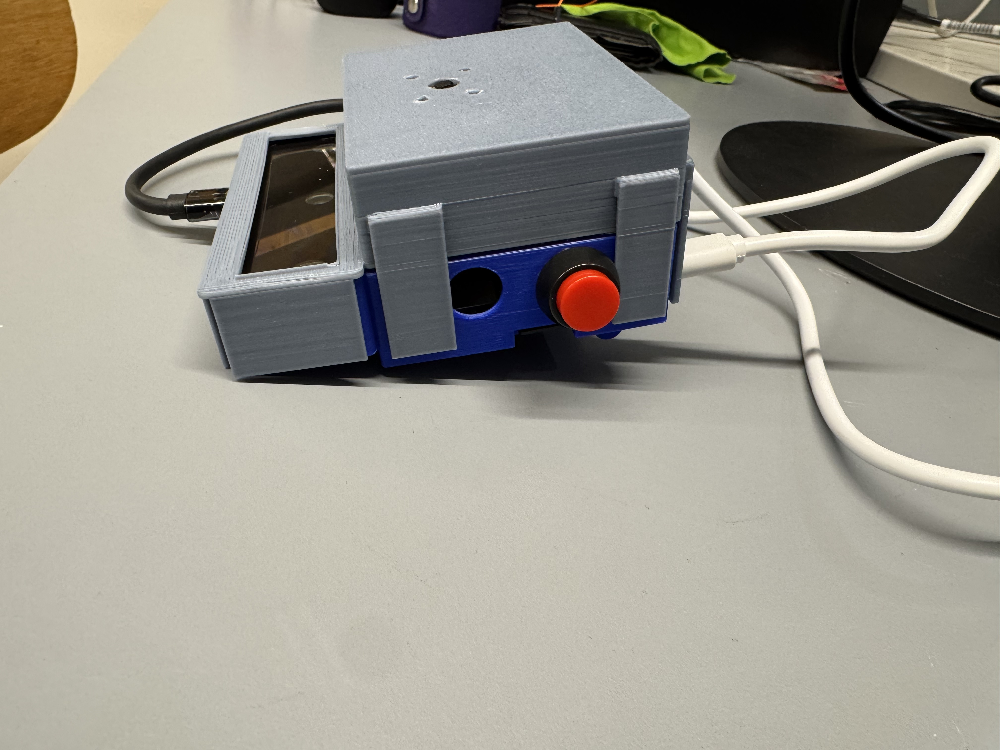
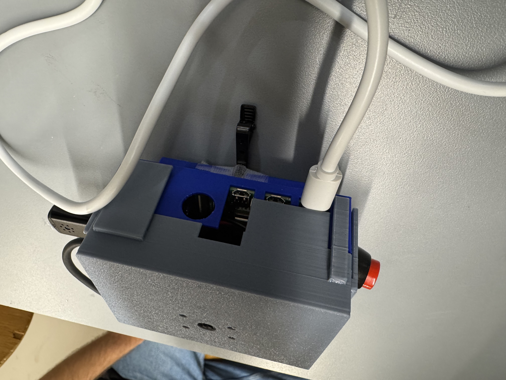
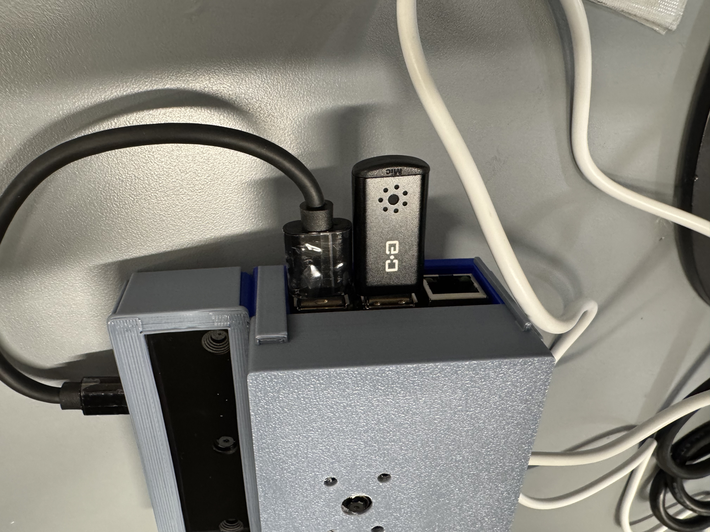
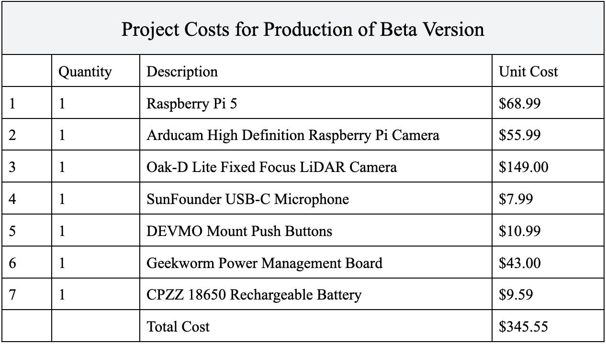

# Mimir: Hardware Components
For our hardware of Mimir, we have multiple components that is connected our computing source, Raspberry Pi 4.  The components are <br>
```
    - Raspberry Pi 4
    - LiDAR Camera 
    - Raspberry Pi Camera
    - M/F Jumper Wires
    - Tactile Buttons
    - USB Microphone
```
Combining all these components creates our assistive device, Mimir. Most of our choices in designing our hardware of the device was mostly centered around out iniative towards having high computing power to process and perform multithreading of features and functions, such as our image processing, cloud client-server interactions, and hardware inputs/outputs. Which is why we mostly focused on using the Raspberry Pi 5, but eventually switched to the Raspberry Pi 4 instead, due to the better capacity in maintining our various inputs/outputs.


### Assembling the Device
When assmbing the device, we would first have our Raspberry Pi 4 (RPi 4), begin by setting it firmly in its customized 3D-printed case. Once set into the case, the LiDAR camera is placed into its housing unit, and the RPi Camera is attached to its docking camera feed. Next we attach the USB C cord from the LiDAR camera to the RPi, and attach screws to the RPi Camera to mount the camera to the lid of the case. The USB microphone can be attached to the USB input. Once fastened, the lid of the case can be closed and USB C cord can be plugged into a local wall outlet. The user can then press the button to initiate the device. <br>


<!-- Battery Terminal -->


<!-- Raspberry Pi 4 -->
<p align="center">

</p>
<p align="center">
Raspberry Pi 4 (w/USB Microphone, RPi Camera attached)<br>
</p>
<p align="center">

</p>

<!-- device itself -->
<p align="center">

</p>
<p align="center">

</p>
<p align="center">

</p>
<p align="center">
Mimir Device<br>
</p>

### Schematics
text <br>


### Power Requirements
Our power requirments only involves the usage of an USB C cord that can be plugged into the wall. This choice of power source was due to having multiple RPi's being fried from multiple attempts of attaching our RPi's battery pack and having the RPi perform multiple multithreading processes. Which was why we've decided to simply have our device powered via a USB C cord to supply power. <br>


### Vendor and Bill of Materials (BOM)
text

<p align="center">

</p>
<p align="center">
Bills of Materials<br>
</p>

<br>

More information can be found in our [User's Manual](./Users-Manual.pdf).<br>
<br>

### References
[User's Manual](./Users-Manual.pdf) <br>
[]() <br>
