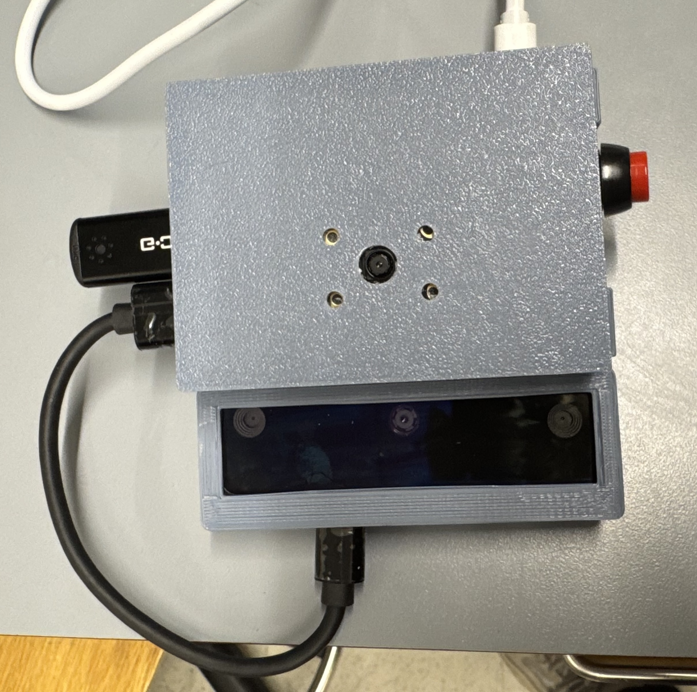

# Mimir: Hardware Components
For our hardware of Mimir, we have multiple components that is connected our computing source, Raspberry Pi 4.  The components are <br>
```
    - Raspberry Pi 4
    - LiDAR Camera 
    - Raspberry Pi Camera
    - Battery Pack for RPi 4
    - M/F Jumper Wires
    - Tactile Buttons
    - USB Microphone
```
Combining all these components creates our assistive device, Mimir. Most of our choices in designing our hardware of the device was mostly centered around out iniative towards having high computing power to process and perform multithreading of features and functions, such as our image processing, cloud client-server interactions, and hardware inputs/outputs. Which is why we mostly focused on using the Raspberry Pi 5, but eventually switched to the Raspberry Pi 4 instead, due to the better capacity in maintining our various inputs/outputs.


### Assembling the Device
When assmbing the device, we would first have our Raspberry Pi 4 (RPi 4), begin by setting it firmly in its customized 3D-printed case. <br>

<!-- Battery Terminal -->


<!-- Raspberry Pi 4 -->
<p align="center">

</p>
<p align="center">
Raspberry Pi 4<br>
</p>

<!-- device itself -->
<p align="center">

</p>
<p align="center">
Mimir Device<br>
</p>

### Schematics
text <br>


### Power Requirements
Our power requirments only involve the usage of a battery terminal. <br>


### Vendor and Bill of Materials (BOM)
text <br>
<br>
More information can be found in our [User's Manual](./Users-Manual.pdf).<br>
<br>

### References
[User's Manual](./Users-Manual.pdf) <br>
[]() <br>