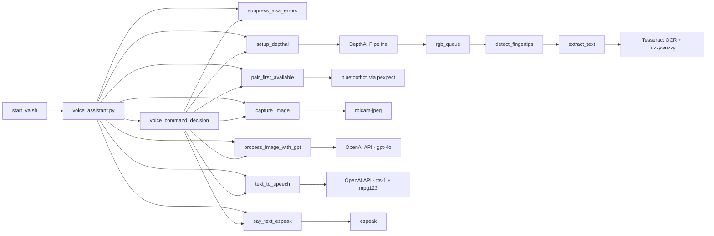

# Software Report

## 1. Module Overview

### 1.1 `voice_assistant.py`  
**Purpose:** Listens for voice commands, performs actions (Bluetooth pairing, image analysis, hand-tracking OCR), and provides verbal feedback.

**Key Sections:**
- **ALSA Error Suppression**  
  - `suppress_alsa_errors()` installs a no-op ALSA error handler to silence terminal warnings.
- **Voice Recognition Setup**  
  - Loads Vosk model and initializes `KaldiRecognizer` with keywords:  
    `analyze`, `liquid`, `track`, `nutrition`, `identify`, `stop`, `bluetooth`, `echo`, `shutdown`, `dictate`.  
  - Auto-detects USB microphone via PyAudio.
- **DepthAI Hand Tracking**  
  - `setup_depthai()` builds a 480×480 DepthAI pipeline and returns a non-blocking `rgb_queue`.  
  - `detect_fingertips(img)` uses MediaPipe Hands to locate the index-finger tip.  
  - `extract_text(image, fingertip)` crops an ROI around the fingertip, preprocesses (gray, blur, threshold, upsample), runs Tesseract OCR, then fuzzy-matches the first word against `kitchen_words`.
- **Bluetooth Pairing**  
  - `pair_first_available()` drives `bluetoothctl` via `pexpect` to pair, trust, and connect to a target device.
- **OpenAI Integration**  
  - `capture_image(path)` uses `rpicam-jpeg` to snap a photo.  
  - `process_image_with_gpt(path, prompt)` encodes the image and sends it to GPT-4o for analysis.  
  - `text_to_speech(text)` uses OpenAI’s `tts-1` to generate audio and plays it via `mpg123`.
- **Espeak TTS Fallback**  
  - `say_text_espeak(text)` pauses the mic, speaks via `espeak`, then resumes the mic.
- **Voice Command Router**  
  - `voice_command_decision(word)` maps recognized keywords to the above functions and toggles `trackOn` for hand tracking.
- **Main Loop**  
  - Reads audio chunks and enters “command mode” on `dictate`.  
  - When `trackOn` is `True`, non-blocking fetches video frames, runs fingertip OCR, and speaks any detected words.

### 1.2 `start_va.sh`  
**Purpose:** Wrapper script for cron/systemd that sets up the environment and launches the assistant at boot.

**Workflow:**
1. Redirects all output into `/home/visualAI/Desktop/va.log`.  
2. Exports environment variables:
   ```bash
   export AUDIODEV=pulse
   export SDL_AUDIODRIVER=pulse
   export HEADLESS=1
   1. Redirects all output into `/home/visualAI/Desktop/va.log`.  
3. Sleeps 10 s to let USB/audio subsystems initialize.
4. `cd /home/visualAI/Desktop/voice_assistant` to ensure relative paths work
5. Activates the virtual environment: `source /home/visualAI/Desktop/venv/bin/activate`
6. Executes the assistant: `exec /home/visualAI/Desktop/venv/bin/python voice_assistant.py`

## 2. Flowchart




## 3. Dev/Build tool information

| Component           | Version         | Installation Method                                      |
|---------------------|-----------------|----------------------------------------------------------|
| **OS**              | Bullseye 64-bit | Raspberry Pi OS                                          |
| **Python**          | 3.10.x          | `apt install python3`                                    |
| **venv**            | built-in        | `python3 -m venv venv`                                   |
| **vosk**            | 0.3.45          | `pip install vosk`                                       |
| **PyAudio**         | 0.2.11          | `apt install portaudio19-dev` + `pip install pyaudio`    |
| **DepthAI**         | 2.21.2.0        | `pip install depthai`                                    |
| **OpenCV-Python**   | 4.7.0.72        | `pip install opencv-python`                              |
| **MediaPipe**       | 0.10.0          | `pip install mediapipe`                                  |
| **NumPy**           | 1.23.x          | `pip install numpy`                                      |
| **PyTesseract**     | 0.3.10          | `apt install tesseract-ocr` + `pip install pytesseract`  |
| **fuzzywuzzy**      | 0.18.0          | `pip install fuzzywuzzy[speedup]`                        |
| **openai**          | 0.27.1          | `pip install openai`                                     |
| **pexpect**         | 4.8.0           | `pip install pexpect`                                    |
| **espeak**          | 1.48.15         | `apt install espeak`                                     |
| **mpg123**          | 1.29.1          | `apt install mpg123`                                     |
| **cron**            | built-in        | configured via `crontab -e` for `@reboot` entry          |


## 4. Installation from Scratch

### 4.1. **System update & essentials**  
   ```bash
   sudo apt update && sudo apt upgrade -y
   sudo apt install -y \
     python3 python3-venv python3-pip \
     portaudio19-dev pulseaudio \
     tesseract-ocr libatlas-base-dev \
     espeak mpg123 cmake libusb-1.0-0-dev build-essential
```

### 4.2. **Clone & set up project**  
   ```bash
   cd /home/visualAI/Desktop
   git clone https://github.com/HoujieXiong/EC463_Mimir.git
   cd voice_assistant
   python3 -m venv venv
   source venv/bin/activate
```

### 4.3. **Install python dependencies**  
   ```bash
   pip install --upgrade pip
   pip install \
     vosk \
     pyaudio \
     depthai \
     opencv-python \
     mediapipe \
     numpy \
     pytesseract \
     fuzzywuzzy[speedup] \
     openai \
     pexpect
```

### 4.4. **Prepare startup script**  
   ```bash
   chmod +x start_va.sh
```
### 4.5 **Configure auto-start with cron**  
   ```bash
   crontab -e

Add to the very bottom

  ```bash
   @reboot /home/visualAI/Desktop/voice_assistant/start_va.sh
   ```

### 4.6. **Reboot and verify**  
   ```bash
   sudo reboot
   tail -f /home/visualAI/Desktop/va.log
